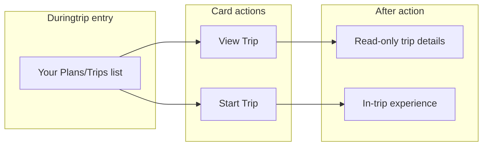

# Duringtrip UI Rebuild: Your Plans/Trips List

**Status:** Draft  
**Audience:** Engineering, Design  
**Reference:** Mockup — mobile list view with header, trip cards, View Trip / Start Trip actions

---

## 1. Summary / Goals

- Rebuild the duringtrip micro-frontend entry experience to match the "Your Plans/Trips" list mockup.
- Use the same trip data source and patterns as mf-pretrip where applicable.
- Deliver: header (TripWeave, Post-Itinerary, hamburger), section title "Your Plans/Trips", and scrollable trip cards with image placeholder, one-line metadata, and View Trip / Start Trip buttons.
- Optimize for mobile view preferred

---

## 2. User Stories & Acceptance Criteria

### List view

- **US-1** As a user, I see a list of my plans/trips when I open duringtrip (when no trip is active).
  - **AC1** List shows trips I own or collaborate on (same as pretrip).
  - **AC2** Each card shows: destination (or title), duration in days, number of people, number of places (itinerary activities).
  - **AC3** Cards are scrollable; layout is mobile-first.

### Header

- **US-2** As a user, I see a consistent header with app branding and actions.
  - **AC1** Left: TripWeave logo + app name.
  - **AC2** Center-right: "Post-Itinerary" button (placeholder: visible, no-op or TODO).
  - **AC3** Right: Hamburger menu (Settings, Log out, optional links to Pretrip/Itinerary).

### Card actions

- **US-3** As a user, I can view trip details without starting the trip.
  - **AC1** "View Trip" opens a read-only trip/details view (screen or modal).
  - **AC2** Does not set the trip as "active" or enter the in-trip experience.

- **US-4** As a user, I can start a trip and enter the in-trip experience.
  - **AC1** "Start Trip" sets the trip as active and navigates to the in-trip experience (e.g. map, day view).
  - **AC2** Subsequent duringtrip usage reflects this active trip until changed.

---

## 3. UI Specification

- **Header bar:** Horizontal; left: logo (light grey square) + "TripWeave" text; center-right: "Post-Itinerary" button (rounded, light grey bg, thin border); far right: hamburger (three horizontal lines).
- **Section title:** "Your Plans/Trips" — bold, left-aligned, prominent.
- **Trip cards:**
  - Container: rectangular card with subtle elevation/border; consistent vertical spacing between cards.
  - **Image:** Large rectangular light grey placeholder (~2/3 of card height). No real images in scope.
  - **Metadata line:** One line, standard weight, smaller than section title. Format: `{destination} · {N} days · {N} people · {N} places` (e.g. "Japan · 7 days · 4 people · 10 places").
  - **Actions:** Two buttons side-by-side below metadata:
    - **View Trip:** White background, thin black border, black text.
    - **Start Trip:** Solid black background, white text.
- **Styling:** White backgrounds, grey placeholders/outlines, black text and primary button; sans-serif; consistent padding and margins; mobile-optimized, scrollable list.

---

## 4. Data & Integration

- **Trip list source:** Same as pretrip. Use Supabase + authenticated user to fetch trips (owned + collaborative). Add to mf-duringtrip: `@supabase/supabase-js`, `@tanstack/react-query`, and `@travel-app/shared-types`; reuse or mirror the pattern in `useUserTrips` (see references below).
- **Auth / member:** Duringtrip must have access to the authenticated user (e.g. member context or Supabase session) to load the trip list.
- **"Places" count:** Number of itinerary activities from the built itinerary. Source: `trip_itineraries.itinerary` JSON — count activities across all `days`. Implementation may extend the trip list query (e.g. join/aggregate) or add a small server endpoint that returns trips with an activity count; PRD does not mandate which.

**References:**

- Trip type and list: `client/mf-pretrip/src/hooks/useUserTrips.ts` (`CollaborativeTrip`, Supabase query).
- Schema: `client/shared-types/src/database.types.ts` — `trips`, `trip_itineraries` (itinerary JSON).

---

## 5. Behavior Specification

| Element | Behavior |
|--------|----------|
| **Post-Itinerary** | Placeholder only. Button visible in header; no-op or TODO. |
| **View Trip** | Opens read-only trip/details view. Does not set active trip. |
| **Start Trip** | Sets trip as active; navigates to in-trip experience (e.g. map, day view). |
| **Hamburger menu** | Settings, Log out, optional navigation to Pretrip / Itinerary MFs. |

---

## 6. Technical Approach

- **Pretrip patterns to reuse:**
  - Trip type and list: `client/mf-pretrip/src/hooks/useUserTrips.ts`.
  - Header layout idea: `client/mf-pretrip/src/components/layout/TripHeader.tsx` (mockup differs: logo left, Post-Itinerary, hamburger).
  - Trip display/formatting: `client/mf-pretrip/src/components/TripItem.tsx` — adapt to card with image placeholder, metadata line, and two buttons.
  - App/providers: `client/mf-pretrip/src/App.tsx` — QueryClient, MemberProvider, ModalProvider; consider similar setup in duringtrip for auth + trip list.
- **Duringtrip changes:**
  - Add dependencies: Supabase, TanStack Query, shared-types (and any peer deps for auth).
  - New list view (default when no active trip): "Your Plans/Trips" title + list of trip cards.
  - New trip card component: image placeholder, "destination · days · people · places", View Trip + Start Trip.
  - Routing/state for "active trip": define how active trip is stored (e.g. URL, context, shell) and gate: if active trip exists, show in-trip experience; else show list view.
- **Current duringtrip:** `client/mf-duringtrip/src/App.tsx` is location/map/notification demo; replace or gate by "no active trip" so the new list view is the entry when no trip is active.

---

## 7. Flow (high level)

---

## 8. Out of Scope / Assumptions

- **Trip card image:** Placeholder only (grey block). No image API or upload in this rebuild.
- **Post-Itinerary:** UI placeholder only; no backend or full flow.
- **List backend:** Reuse/extend existing trip (and optionally itinerary) data; no new list-specific backend contract required beyond possibly returning activity count.
- **In-trip experience:** "Start Trip" navigates to it; detailed UX of in-trip screens is out of scope for this PRD.

---

## 9. Open Questions / Follow-ups

- **Places count:** Implement via extended `useUserTrips` (e.g. join to `trip_itineraries` and compute activity count client-side or via RPC) vs. a small server endpoint that returns trips with counts. Decision left to implementation.
- **Active trip persistence:** How and where to store "active trip" (URL param, React context, shell state) so that duringtrip shows list vs. in-trip experience correctly across reloads/navigation.
